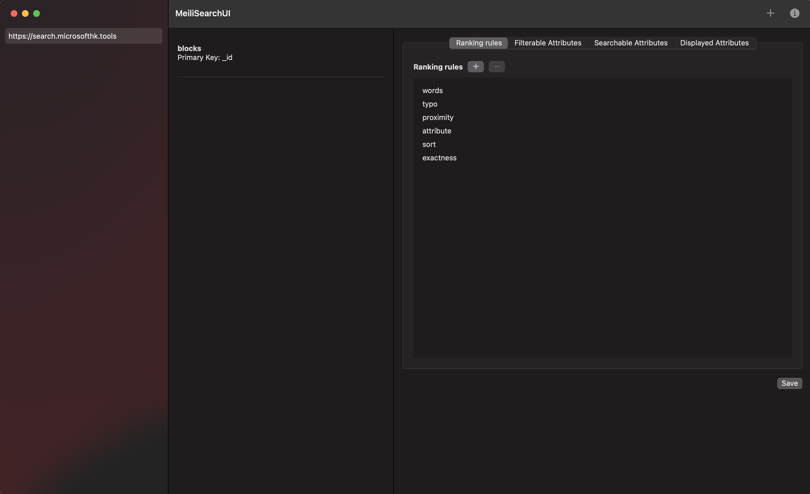
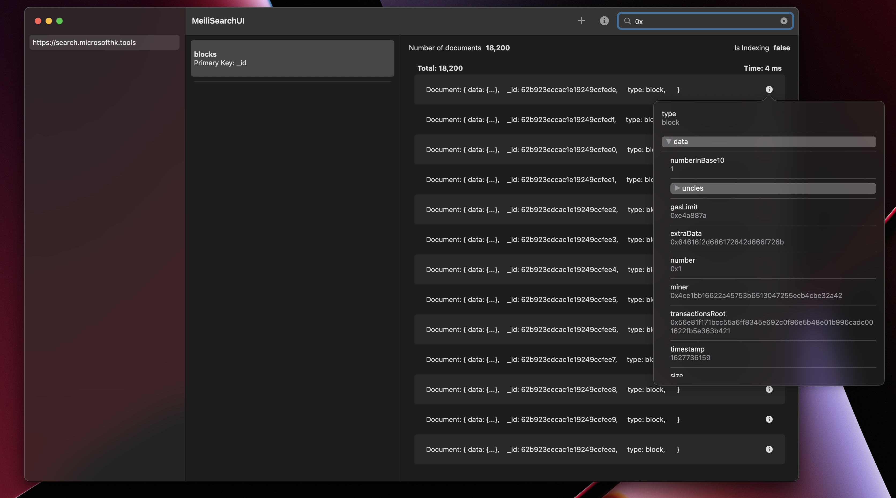

# MeiliSearch MacOS UI

This is a simple UI for [MeiliSearch](https://www.meilisearch.com/) using SwiftUI.

It currently supports following functionalities:
- Search document
- Add/Edit/Update Index
- Multiple Hosts
- Add Documents
- Add Documents by dropping a JSON file
- View Document through [SwiftJSONViewer](https://github.com/sirily11/SwiftJSONView)

